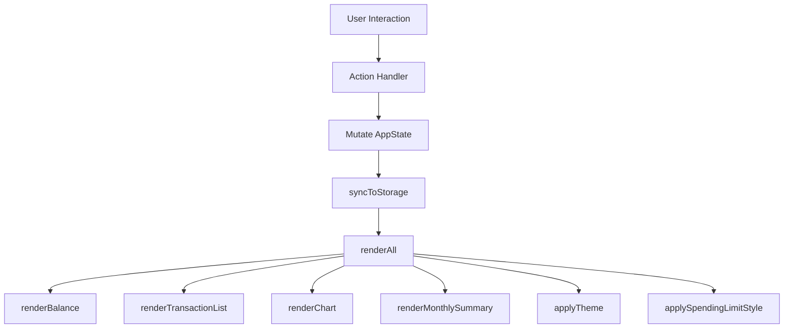

# Design

## Overview

The Expense & Budget Visualizer is a fully client-side single-page application (SPA) built with plain HTML, CSS, and Vanilla JavaScript. It allows users to record expense transactions, visualize spending by category via a pie chart, monitor a running total balance against an optional spending limit, switch between light and dark themes, and review monthly spending summaries — all without any backend server. All application state is persisted in the browser's Local Storage.

### Key Design Goals

- **Zero dependencies at runtime** except Chart.js (loaded via CDN) for the pie chart.
- **Single-file simplicity**: one HTML file, one CSS file (`css/style.css`), one JS file (`js/app.js`).
- **State-first architecture**: a single in-memory state object is the source of truth; every UI update is a pure function of that state.
- **Graceful degradation**: Local Storage failures surface a dismissible notification without crashing the app.

---

## Architecture

The app uses a lightweight **unidirectional data flow** pattern:

```
User Action → State Mutation → Persist to Local Storage → Re-render UI
```

All state lives in a single in-memory object (`AppState`). Functions that mutate state always call `syncToStorage()` followed by `renderAll()`. There is no reactive framework — rendering is explicit, synchronous, and cheap enough for the data volumes involved.



### File & Folder Structure

```
project-root/
├── index.html
├── css/
│   └── style.css          ← single CSS file
└── js/
    └── app.js             ← single JavaScript file
```

Chart.js is loaded from CDN inside `index.html`:
```html
<script src="https://cdn.jsdelivr.net/npm/chart.js@4/dist/chart.umd.min.js"></script>
```

---

## Components and Interfaces

### HTML Structure

```
<body data-theme="light|dark">
  ├── <header>                         ← sticky header
  │   ├── <h1> App Title
  │   └── <button id="theme-toggle">   ← Theme_Toggle (always visible)
  │
  └── <main>
      ├── #balance-section             ← Balance_Display (first in main)
      │   ├── #balance-display         ← total amount + currency
      │   └── #spending-limit-form     ← spending limit input + set/clear buttons
      │
      ├── #input-section               ← Add Transaction form
      │   └── <form id="add-form">
      │       ├── #item-name           ← text input
      │       ├── #amount              ← number input
      │       ├── #category            ← select (Food / Transport / Fun)
      │       ├── #form-errors         ← inline validation messages
      │       └── <button type="submit">
      │
      ├── #chart-section               ← Pie_Chart
      │   └── #chart-container
      │       ├── <canvas id="spending-chart">
      │       └── #chart-empty-msg     ← "No spending data to display"
      │
      ├── #transaction-section         ← Transaction_List
      │   └── #transaction-list        ← scrollable <ul>
      │       └── <li> × N            ← one per transaction
      │           ├── .tx-name
      │           ├── .tx-amount
      │           ├── .tx-category
      │           └── <button class="delete-btn">
      │
      └── #monthly-summary-section     ← Monthly_Summary
          ├── #month-select            ← <select> 1–12
          ├── #year-select             ← <select> earliest–current year
          ├── #summary-body            ← per-category rows
          ├── #summary-grand-total     ← grand total row
          └── #summary-empty-msg       ← "No data available for this period"

  <div id="error-notification">        ← Local Storage error banner (dismissible)
      <span id="error-message">
      <button id="dismiss-error">
```

### JavaScript Module Organization (single file `js/app.js`)

The file is organized into clearly separated sections using block comments:

```
/* ═══════════════════════════════════
   CONSTANTS & LOCAL STORAGE KEYS
   ═══════════════════════════════════ */

/* ═══════════════════════════════════
   STATE
   ═══════════════════════════════════ */

/* ═══════════════════════════════════
   LOCAL STORAGE HELPERS
   ═══════════════════════════════════ */

/* ═══════════════════════════════════
   VALIDATION
   ═══════════════════════════════════ */

/* ═══════════════════════════════════
   STATE MUTATORS
   ═══════════════════════════════════ */

/* ═══════════════════════════════════
   RENDER FUNCTIONS
   ═══════════════════════════════════ */

/* ═══════════════════════════════════
   CHART (Chart.js)
   ═══════════════════════════════════ */

/* ═══════════════════════════════════
   MONTHLY SUMMARY
   ═══════════════════════════════════ */

/* ═══════════════════════════════════
   EVENT LISTENERS
   ═══════════════════════════════════ */

/* ═══════════════════════════════════
   INIT
   ═══════════════════════════════════ */
```

#### Key Function Signatures

| Function | Purpose |
|---|---|
| `loadFromStorage()` | Reads all LS keys; returns parsed state; handles errors |
| `syncToStorage()` | Serializes AppState → writes all LS keys; catches errors |
| `validateTransaction(name, amount, category)` | Returns `{ valid, errors }` |
| `validateSpendingLimit(value)` | Returns `{ valid, error }` |
| `addTransaction(name, amount, category)` | Mutates state, syncs, re-renders |
| `deleteTransaction(id)` | Mutates state, syncs, re-renders |
| `setSpendingLimit(value)` | Mutates state, syncs, re-renders |
| `clearSpendingLimit()` | Removes limit from state and LS |
| `setTheme(theme)` | Applies theme attribute + persists |
| `toggleTheme()` | Calls setTheme with opposite value |
| `renderAll()` | Calls all render sub-functions |
| `renderBalance()` | Updates `#balance-display` text and warning style |
| `renderTransactionList()` | Rebuilds `#transaction-list` from state |
| `renderChart()` | Builds Chart.js dataset from state, calls chart update |
| `renderMonthlySummary()` | Filters + aggregates for selected month/year |
| `computeBalance(transactions)` | Pure function: sum of all amounts |
| `computeCategoryTotals(transactions)` | Pure function: `{ Food, Transport, Fun }` |
| `computeMonthlySummary(transactions, month, year)` | Pure function: filtered category totals + grand total |
| `formatCurrency(amount)` | Pure function: formats number as `$X,XXX.XX` |
| `showErrorNotification(message)` | Renders the error banner |
| `dismissErrorNotification()` | Hides the error banner |
| `initYearSelector()` | Populates year `<select>` based on transaction data |

---

## Data Models

### Transaction Object

```js
{
  id: string,           // crypto.randomUUID() or Date.now().toString()
  name: string,         // 1–100 characters
  amount: number,       // positive, max 2 decimal places, range [0.01, 999999999.99]
  category: string,     // "Food" | "Transport" | "Fun"
  timestamp: number     // Date.now() at insertion time — used for display ordering
}
```

### AppState Object (in-memory)

```js
const AppState = {
  transactions: [],     // Transaction[]
  spendingLimit: null,  // number | null
  theme: "light",       // "light" | "dark"
  storageAvailable: true // boolean — set during init
};
```

### Local Storage Keys

| Key | Type | Description |
|---|---|---|
| `ebv_transactions` | JSON string (array) | Serialized array of Transaction objects |
| `ebv_spending_limit` | JSON string (number) | Spending limit value |
| `ebv_theme` | string | `"light"` or `"dark"` |

All keys are namespaced with the `ebv_` prefix to avoid collisions with other apps sharing the same origin.

### Serialization Contract

- Transactions are serialized with `JSON.stringify(AppState.transactions)` and deserialized with `JSON.parse(...)`.
- After deserialization, each transaction's `amount` is coerced to `Number` to guard against string-type drift.
- The spending limit is stored as a plain numeric string and parsed with `parseFloat`.

---

## CSS Architecture

### File: `css/style.css`

#### Custom Properties (Design Tokens)

All colors, spacing, and shadows are defined as CSS custom properties on `:root` and overridden on `[data-theme="dark"]`:

```css
:root {
  --color-bg: #f8f9fa;
  --color-surface: #ffffff;
  --color-text: #212529;
  --color-text-muted: #6c757d;
  --color-primary: #4361ee;
  --color-danger: #e63946;
  --color-warning-bg: #fff3cd;
  --color-warning-border: #e0a800;
  --color-warning-text: #856404;
  --color-border: #dee2e6;
  --shadow-sm: 0 1px 3px rgba(0,0,0,.08);
  --shadow-md: 0 4px 12px rgba(0,0,0,.12);
  --radius: 0.5rem;
  --spacing: 1rem;
}

[data-theme="dark"] {
  --color-bg: #121212;
  --color-surface: #1e1e1e;
  --color-text: #e0e0e0;
  --color-text-muted: #9e9e9e;
  --color-primary: #7b8cde;
  --color-danger: #ef5350;
  --color-warning-bg: #3d2f00;
  --color-warning-border: #e0a800;
  --color-warning-text: #ffd54f;
  --color-border: #333333;
}
```

#### Layout

- The page uses a **centered single-column layout** (`max-width: 860px; margin: 0 auto`) with responsive padding.
- The `<header>` is `position: sticky; top: 0` to keep the theme toggle always visible.
- `#transaction-list` has `max-height: 360px; overflow-y: auto` to make it independently scrollable.
- A CSS Grid with two columns (`repeat(2, 1fr)`) is used for the chart + transaction list side-by-side on wide viewports, collapsing to single column below `640px`.

#### Spending Limit Warning

The `#balance-display` element receives a `.limit-exceeded` class when the total surpasses the spending limit:

```css
#balance-display.limit-exceeded {
  background: var(--color-warning-bg);
  border: 2px solid var(--color-warning-border);
  color: var(--color-warning-text);
}
```

#### Theme Transition

```css
body, body * {
  transition: background-color 0.2s ease, color 0.2s ease, border-color 0.2s ease;
}
```

---

## Chart.js Integration

### Library Loading

Chart.js 4.x is loaded via CDN `<script>` tag placed before `js/app.js` in `index.html`. This keeps the bundle zero-config and avoids a build step.

### Chart Instance Management

A single Chart.js `Pie` instance is created at init time and stored in a module-scoped variable (`let chartInstance = null`). On every state change that affects category totals, `renderChart()` updates the existing instance's `data` and calls `chartInstance.update()` — avoiding full destroy/recreate cycles.

```js
// Init (called once)
function initChart() {
  const ctx = document.getElementById('spending-chart').getContext('2d');
  chartInstance = new Chart(ctx, {
    type: 'pie',
    data: { labels: [], datasets: [{ data: [] }] },
    options: {
      plugins: {
        legend: { position: 'bottom' },
        tooltip: {
          callbacks: {
            label: (ctx) => `${ctx.label}: ${ctx.parsed.toFixed(1)}%`
          }
        }
      }
    }
  });
}

// Update (called on every renderChart)
function renderChart() {
  const totals = computeCategoryTotals(AppState.transactions);
  const entries = Object.entries(totals).filter(([, v]) => v > 0);

  if (entries.length === 0) {
    // Show empty state message, hide canvas
    document.getElementById('spending-chart').style.display = 'none';
    document.getElementById('chart-empty-msg').style.display = 'block';
    return;
  }

  document.getElementById('spending-chart').style.display = 'block';
  document.getElementById('chart-empty-msg').style.display = 'none';

  chartInstance.data.labels = entries.map(([k]) => k);
  chartInstance.data.datasets[0].data = entries.map(([, v]) => v);
  chartInstance.update();
}
```

### Category Colors

Fixed color map so categories always render with the same color:

```js
const CATEGORY_COLORS = {
  Food: '#4caf50',
  Transport: '#2196f3',
  Fun: '#ff9800'
};
```

---

## State Management Pattern

### In-Memory Array + Sync to Local Storage

The authoritative state lives in `AppState` (JS heap). Every mutation follows this pattern:

```
1. Validate input (if applicable)
2. Mutate AppState (push/splice/assign)
3. syncToStorage()          ← serialize & write LS; catches errors
4. renderAll()              ← rebuild all UI from AppState
```

`renderAll()` always re-derives display values from scratch (balance, chart data, monthly totals) rather than trying to do differential updates. This keeps render logic simple and correct.

### Error Handling for Local Storage

```js
function syncToStorage() {
  try {
    localStorage.setItem(LS_KEYS.TRANSACTIONS, JSON.stringify(AppState.transactions));
    if (AppState.spendingLimit !== null) {
      localStorage.setItem(LS_KEYS.SPENDING_LIMIT, String(AppState.spendingLimit));
    } else {
      localStorage.removeItem(LS_KEYS.SPENDING_LIMIT);
    }
    localStorage.setItem(LS_KEYS.THEME, AppState.theme);
  } catch (e) {
    showErrorNotification('Unable to save data. Storage may be full or unavailable.');
  }
}
```

On load, `loadFromStorage()` wraps all reads in a try/catch. If it fails, `AppState.storageAvailable` is set to `false`, the app renders in empty state, and the notification is shown. The user can still interact with the app (in-session only) even if storage is unavailable.

---

## Correctness Properties

*A property is a characteristic or behavior that should hold true across all valid executions of a system — essentially, a formal statement about what the system should do. Properties serve as the bridge between human-readable specifications and machine-verifiable correctness guarantees.*

### Property 1: Transaction Add Round-Trip

*For any* valid transaction (valid name, valid amount, valid category), after calling `addTransaction`, the transaction MUST appear in `AppState.transactions` AND the serialized Local Storage value MUST contain that transaction when parsed.

**Validates: Requirements 1.2, 9.1**

---

### Property 2: Validator Correctly Classifies All Inputs

*For any* combination of item name, amount string, and category value, `validateTransaction(name, amount, category)` SHALL return `valid: true` if and only if: name is a non-empty string of at most 100 characters, amount parses to a number in the closed interval [0.01, 999999999.99] with at most 2 decimal places, and category is one of `"Food"`, `"Transport"`, or `"Fun"`.

**Validates: Requirements 1.3, 1.4**

---

### Property 3: Transaction Delete Round-Trip

*For any* list of transactions and any transaction in that list, calling `deleteTransaction(id)` MUST result in: (a) the transaction is absent from `AppState.transactions`, (b) all other transactions remain unchanged, and (c) the Local Storage serialized list no longer contains the deleted transaction.

**Validates: Requirements 3.2, 9.2**

---

### Property 4: Balance Computation Correctness

*For any* list of transactions (including the empty list), `computeBalance(transactions)` SHALL equal the arithmetic sum of all `amount` fields, and `renderBalance()` SHALL display that value formatted as a string matching `/^\$[\d,]+\.\d{2}$/`.

**Validates: Requirements 4.2, 4.5**

---

### Property 5: Spending Limit Warning Invariant

*For any* total balance value and any spending limit value, the `#balance-display` element SHALL have the `.limit-exceeded` class applied if and only if `total > spendingLimit` AND a spending limit is set. When `total <= spendingLimit` OR no spending limit is set, the class SHALL be absent.

**Validates: Requirements 7.3, 7.4**

---

### Property 6: Category Aggregation Correctness

*For any* list of transactions, `computeCategoryTotals(transactions)` SHALL return an object where each key is a category name, each value is the sum of `amount` for all transactions with that category, and only categories with a non-zero total appear as keys. The sum of all values SHALL equal `computeBalance(transactions)`.

**Validates: Requirements 5.1, 5.4, 5.5**

---

### Property 7: Monthly Summary Grand Total Equals Sum of Category Totals

*For any* set of transactions and any (month, year) selection, the grand total returned by `computeMonthlySummary(transactions, month, year)` SHALL equal the sum of all per-category totals in that result. Categories with zero spending for the period SHALL NOT appear in the result.

**Validates: Requirements 8.1, 8.5**

---

### Property 8: Theme Toggle Round-Trip

*For any* starting theme value (`"light"` or `"dark"`), calling `toggleTheme()` twice SHALL result in the active theme returning to its original value. After each call to `toggleTheme()`, the value stored in Local Storage under `ebv_theme` SHALL equal the current active theme applied to `document.body`'s `data-theme` attribute.

**Validates: Requirements 6.2, 6.3**

---

### Property 9: Load Restores Full App State

*For any* persisted app state (arbitrary transactions, spending limit, theme), calling `loadFromStorage()` followed by `renderAll()` SHALL produce an in-memory `AppState` that is deeply equal to the persisted state, with the balance display, theme, spending limit field, and transaction list all reflecting that restored state.

**Validates: Requirements 2.4, 9.4**

---

### Property 10: Transaction List Ordering Invariant

*For any* list of transactions with distinct timestamps, `renderTransactionList()` SHALL render the transactions in strictly descending order of `timestamp` (most recently added first).

**Validates: Requirements 2.1**

---

## Error Handling

| Scenario | Behavior |
|---|---|
| Local Storage unavailable on load | `AppState.storageAvailable = false`; show persistent notification; app runs in-memory only |
| Local Storage write fails (e.g., quota exceeded) | `syncToStorage` catches error; show notification; in-memory state update still applied |
| Form submitted with invalid data | Inline error messages shown per field; form not cleared; transaction not added |
| Spending limit set to invalid value | Inline error shown; existing limit unchanged |
| Chart.js fails to load (CDN unreachable) | `initChart()` guards with `typeof Chart !== 'undefined'`; chart section shows "Chart unavailable" |
| Transaction list empty on load | Empty-state message shown in `#transaction-list` |

### Error Notification Component

The `#error-notification` banner is:
- `role="alert"` and `aria-live="assertive"` for screen reader support
- `position: fixed; bottom: 1rem; left: 50%; transform: translateX(-50%)` so it never obscures main content
- Dismissible via `#dismiss-error` button which calls `dismissErrorNotification()`
- Re-shown on each new storage error (message is updated in place)

---

## Testing Strategy

### Unit Tests (Example-Based)

Focused on specific inputs and error paths:

- `validateTransaction`: empty name, name > 100 chars, zero amount, negative amount, amount with 3 decimal places, no category selected
- `validateSpendingLimit`: zero, negative, non-numeric string, value > max
- `computeBalance`: empty array → 0, single transaction, floating-point precision
- `formatCurrency`: `0 → "$0.00"`, `1234.5 → "$1,234.50"`, `999999999.99 → "$999,999,999.99"`
- `loadFromStorage` with mocked localStorage throwing → returns empty defaults
- Theme applied correctly on load (mock `localStorage.getItem` returning `"dark"`)
- Empty state messages shown when transactions = []

### Property-Based Tests

Using a PBT library (e.g., [fast-check](https://github.com/dubzzz/fast-check) for JavaScript), with a minimum of **100 iterations per property**. Each test is tagged with a comment in the format:

**`Feature: expense-budget-visualizer, Property N: <property_text>`**

| Property | Generator Strategy |
|---|---|
| P1: Transaction Add Round-Trip | `fc.record({ name: fc.string({minLength:1, maxLength:100}), amount: fc.float({min:0.01, max:999999999.99}), category: fc.constantFrom('Food','Transport','Fun') })` |
| P2: Validator Correctness | `fc.tuple(fc.string(), fc.anything(), fc.string())` for invalid; constrained generators for valid |
| P3: Transaction Delete Round-Trip | `fc.array(transactionArb, {minLength:1})` then pick random index |
| P4: Balance Computation | `fc.array(transactionArb)` including empty array |
| P5: Spending Limit Warning Invariant | `fc.tuple(fc.float({min:0}), fc.option(fc.float({min:0.01})))` |
| P6: Category Aggregation | `fc.array(transactionArb)` |
| P7: Monthly Summary Grand Total | `fc.array(transactionArb)` with dates, `fc.integer({min:1,max:12})`, `fc.integer({min:2000})` |
| P8: Theme Toggle Round-Trip | `fc.constantFrom('light','dark')` for initial state |
| P9: Load Restores Full App State | `fc.record({ transactions: fc.array(transactionArb), spendingLimit: fc.option(fc.float({min:0.01})), theme: fc.constantFrom('light','dark') })` |
| P10: Transaction List Ordering | `fc.array(transactionArb, {minLength:2})` with distinct timestamps |

### Integration Tests

- Local Storage read/write round-trip (real `localStorage` in jsdom environment)
- Chart.js `update()` called after add/delete (spy on chart instance)
- Full init sequence with pre-seeded localStorage data

### Cross-Browser Smoke Tests

Manual verification in Chrome, Firefox, Edge, and Safari (latest stable):
- App loads and is interactive within 3 seconds
- Theme toggle persists across page reload
- Transactions survive page refresh
- Pie chart renders correctly in each browser
